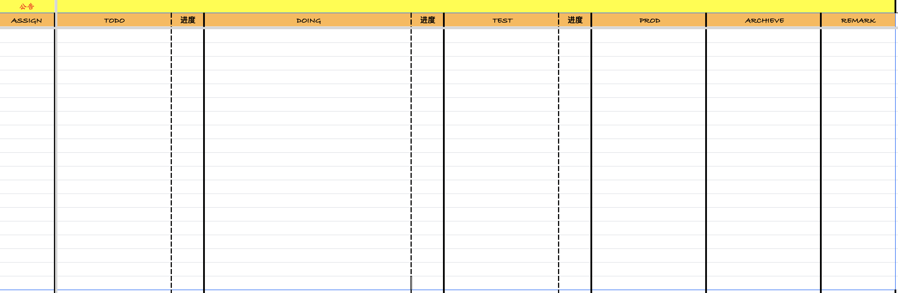
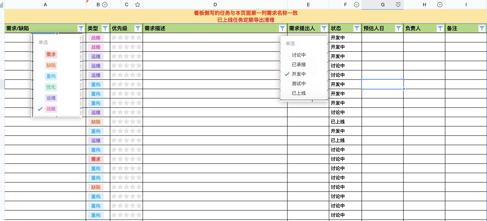
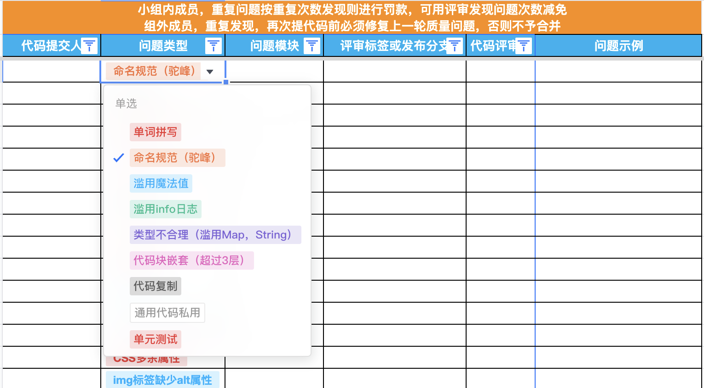
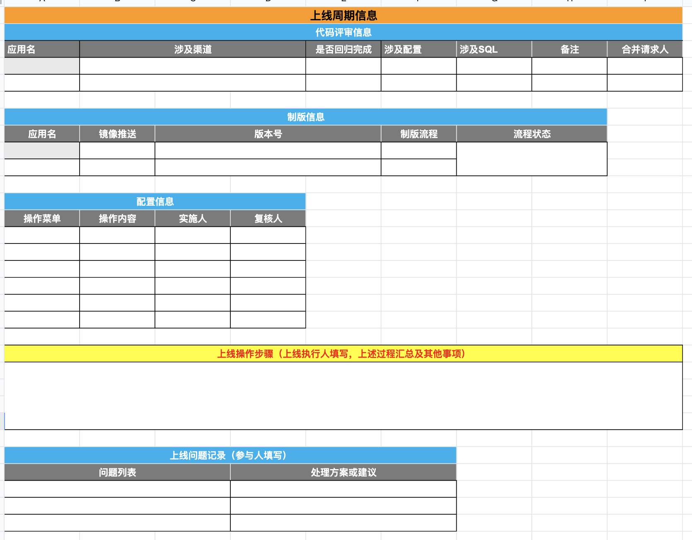
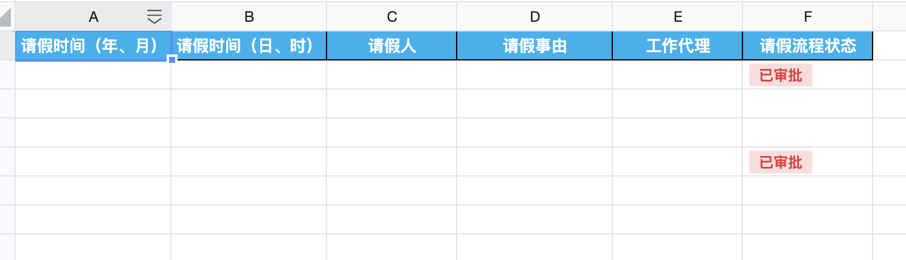
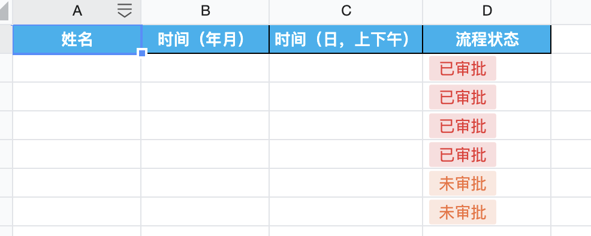
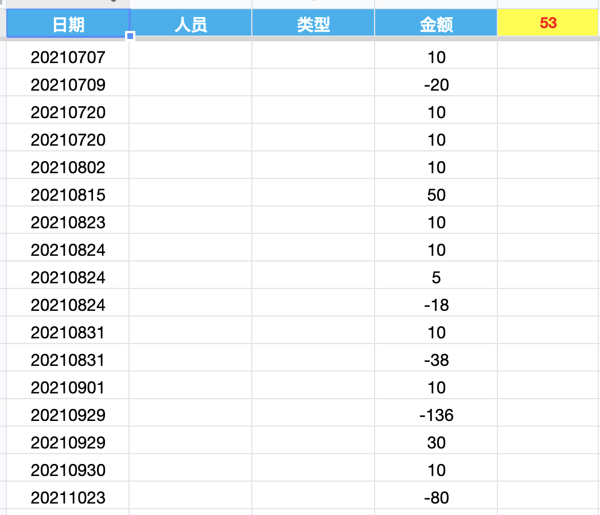
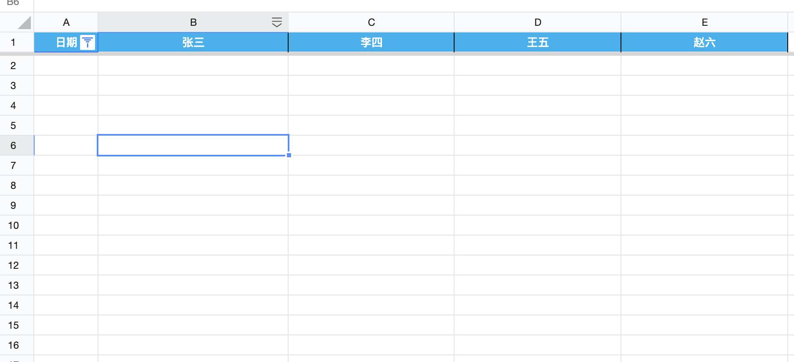

# TeamBoard
team task board, task tracking .etc

### 功能描述

- 看板
- 需求池
- 代码评审
- 上线计划
- WIKI
  - 资源信息
  - 项目流程
  - 团队信息
  - ……
- 请假记录
- 打卡记录
- 经费
- 项目流程
- 周报

#### 看板

看板栏目可以自定义，默认为：

- todo：待做事项，待做事项应当与需求池关联，并处于已承接的状态
- doing：进行中事项，包含进度百分比
- test：测试中事项，包含进度百分比
- prod：投产事项，用于投产流程跟踪，确保投产内容完整，应当与上线计划关联
- archive：归档事项，用于上线完成后的跟踪

看板应当记录每天状态，最小时间粒度为`日`，可进行周、季度、年度汇总

assign列表示任务指派人员，可以通过别的进行标记（头像，颜色等）

公告可记录已读状态

可进行任务状态通知

#### 需求池

**此处一个需求可能产生看板多个任务**

自动隐藏已上线任务

定期生成需求池报告

自动记录时间

#### 代码评审

考虑与上线计划表联动，单独记录成本较高

#### 上线计划

本组件目的是为了保证投产环节的质量

按照实际投产要求制定表格，主要是信息记录，无需太多功能

#### WIKI

团队wiki，包含团队的各种信息记录，备忘等

- 资源信息：系统使用的各种软硬件资源，依赖系统等
- 规范信息：团队开发规范，项目流程规范等
- 成员信息：联系方式，设备信息等
- 其他

应当能够管理文档层级目录

支持MARKDOWN语法（包含mermaid作图）

#### 请假记录

按照上述信息记录，能够统计人员请假情况

#### 漏打卡记录

请假记录和漏打卡记录都是为了落实正常的工作时间能够在岗

#### 经费

团队账本，如果取自于成员，则使用明细对成员透明

#### 周报

团队成员自行总结本周工作

### 系统考虑点

- 功能模块组件化，可插件开发
- 
